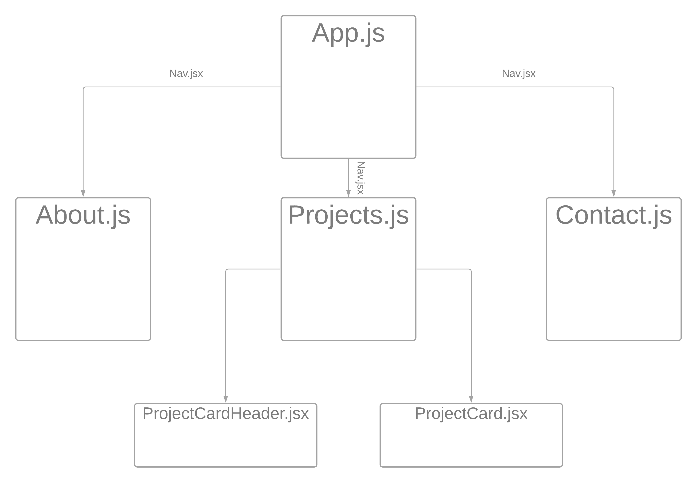

# BaileyCodes: Professional Portfolio for Bailey Leavitt
## July 2021

## Created By: Bailey Leavitt

[Deployed (Check back soon)]() | [Bailey's GitHub](https://www.github.com/baileyjean) | [Bailey's LinkedIn](https://www.linkedin.com/in/baileyleavitt)

***

## Description

Everybody needs a portfolio, which is why I created **BaileyCodes**. It will be periodically updated with any projects I might be working on, showcase some of the front-end skills I've gained since starting General Assembly's Software Engineering Immersive program, and serve as a living resume that I can point potential employers to. Feedback is most welcome!

***

## Technologies Used
HTML | CSS | Javascript | React | Node.js

***

### Screenshots from Design Process

#### Component Hierarchy Diagram (CHD) for frontend:

